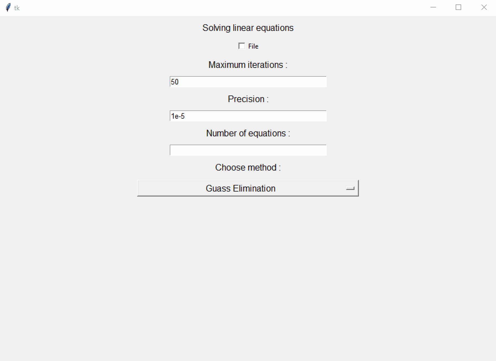
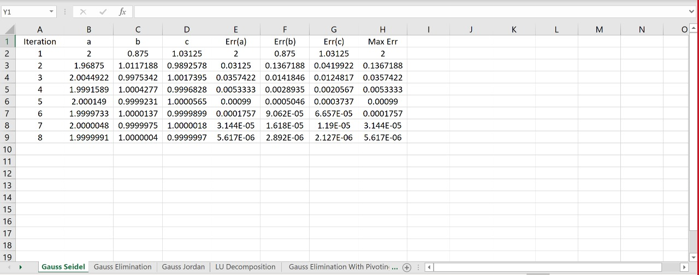
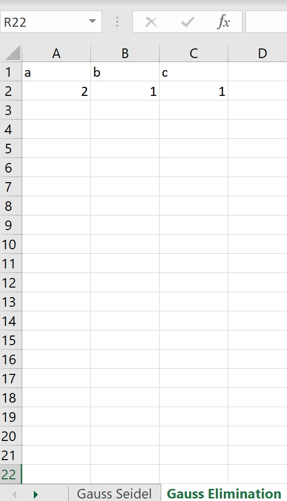
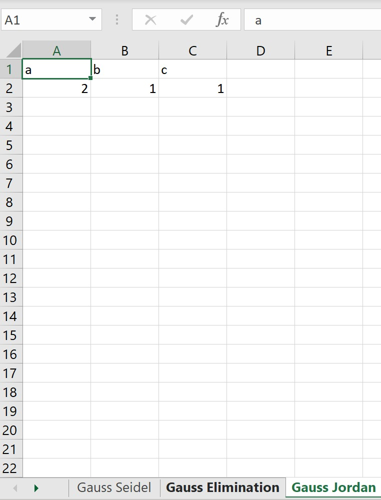
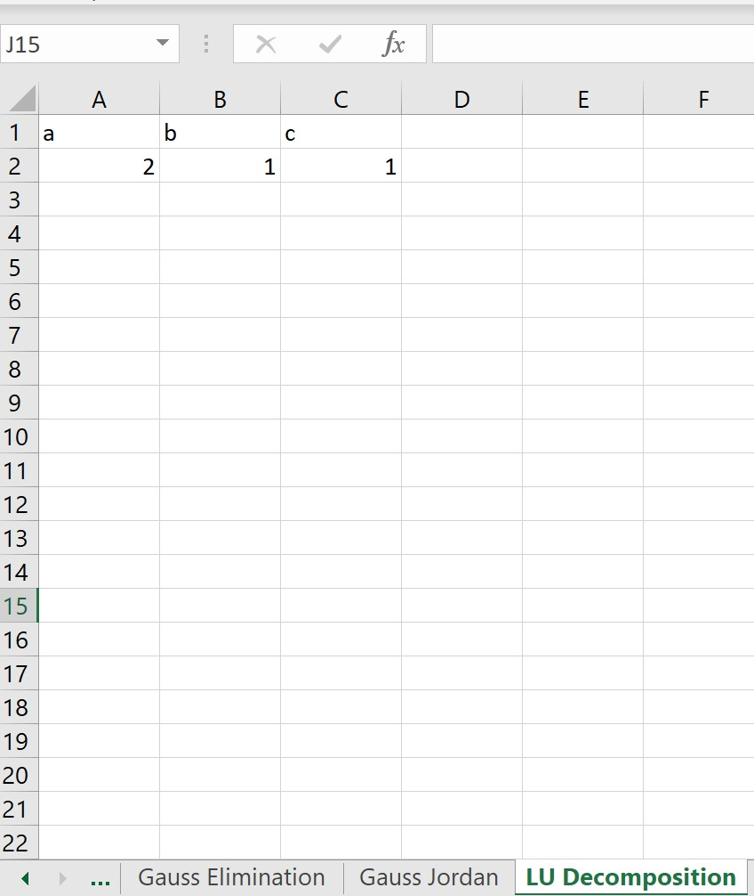
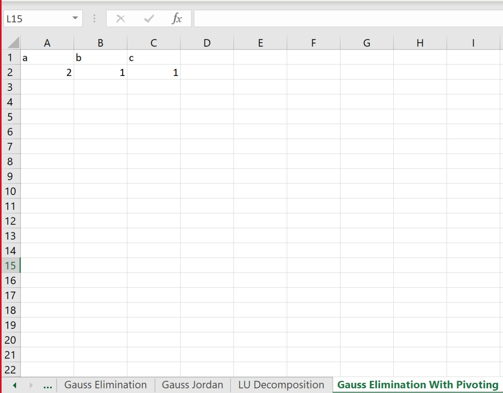

# Linear Equation Solver

Solves linear system of equations using numerical methods

## Numerical Methods Used:

1. Gauss-Seidel
2. Gaussian Elimination
3. Gauss-Jordan
4. LU Decomposition
5. Gaussian Elimination With Pivoting

## Simulation:

### Input



### Output

#### GUI


#### Excel




## Testcases 
```
5*a-b+c-10
2*a+8*b-c-11	
-a+b+4*c-3
```


```
a-b+2*c-8
-c+11
2*b-c+3
```
			

```
25*a+5*b+c-106.8
64*a+8*b+c-177.2
144*a+12*b+c-279.2
144*a+c+3*z-279.2
12*b+c+4*f-279.2
```


```
a+b+d-2
2*a+b-c+d-1
4*a-b-2*c+2*d
3*a-b-c+2*d-3
```

